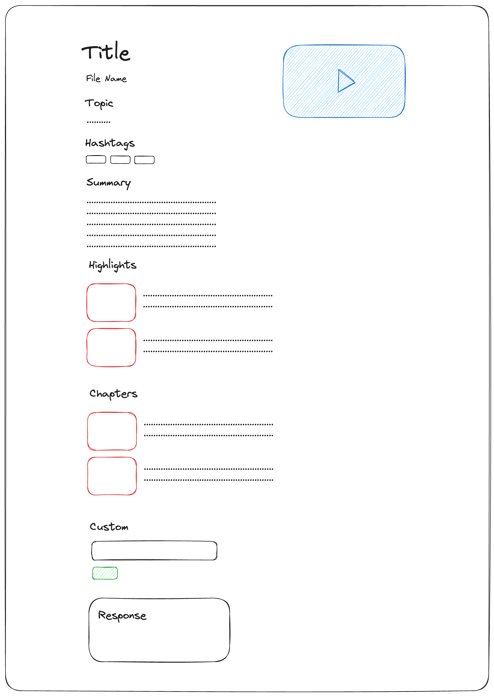

# Twelve Labs Take Home


## Overview

An interface for uploading videos and generating summaries, highlights, chapters, and more by the Twelve Labs API and Pegasus-1 model.

## Initial sketch



## Thought process

- I wanted to create a minimalist UI, similar to Twelve Labs' aesthetic.
- The input video is not the main focus of the page, it's the generations from the API.

## How I went about coding this

### Design

- I started with the UI sketch first as I like to work backwards from the user experience.
- I utilized assets from Twelve Labs like the horse loading gif and the primary color.

### Backend

- Initially, I wrote a basic script to execute functions using the Twelve Labs API.
- After ensuring its functionality, I refined the script, adopting an OOP structure.
- With my experience in FastAPI, I chose it for server-side requests.
- Following that, I developed Pydantic models to structure the output data.

### Frontend

- I then created a simple Next.js app with Typescript and TailwindCSS to display the generations.
- The initial page is just a simple file upload box as I wanted to reduce as much friction as possible.
- Once the video is uploaded, I noticed that the generations were taking ~10 minutes to complete.
- So I added random horse facts to keep the user entertained while waiting.
- Upon completion, the generations are displayed in a simple format with the video floating and draggable.

### Docker

- I combined the backend and the frontend dockers using docker compose.

## Prompts used

I took an educational approach to the prompts to make sure the output is informative and teaching something new.

### Summary

- "Generate a concise educational summary of the video in one paragraph."

### Highlights

- "Generate highlights to identify and describe the most informative moments of the video."

### Chapters

- "Generate chapters that outline the main educational points of the video in detail."

## How to run

1. Add your Twelve Labs `API_KEY` and `API_URL` in `backend/.env` using the `backend/.env.template`.
2. Add `NEXT_PUBLIC_API_URL=http://localhost:8000` to `frontend/.env.local`.
3. Open Docker
4. cd to the root directory and run `docker-compose up --build`.
5. The frontend will be running at `http://localhost:3000` and backend will be running at `http://localhost:8000`.

### Restart Docker

```
docker-compose down
docker system prune -a -f
docker-compose build --no-cache
docker-compose up
```
